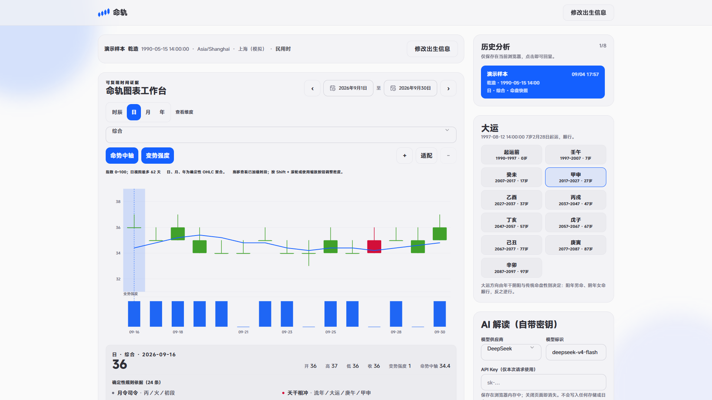
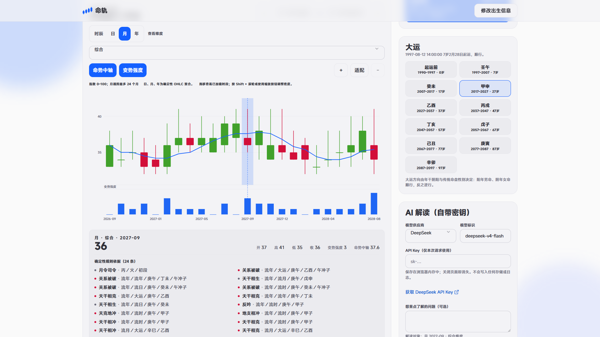
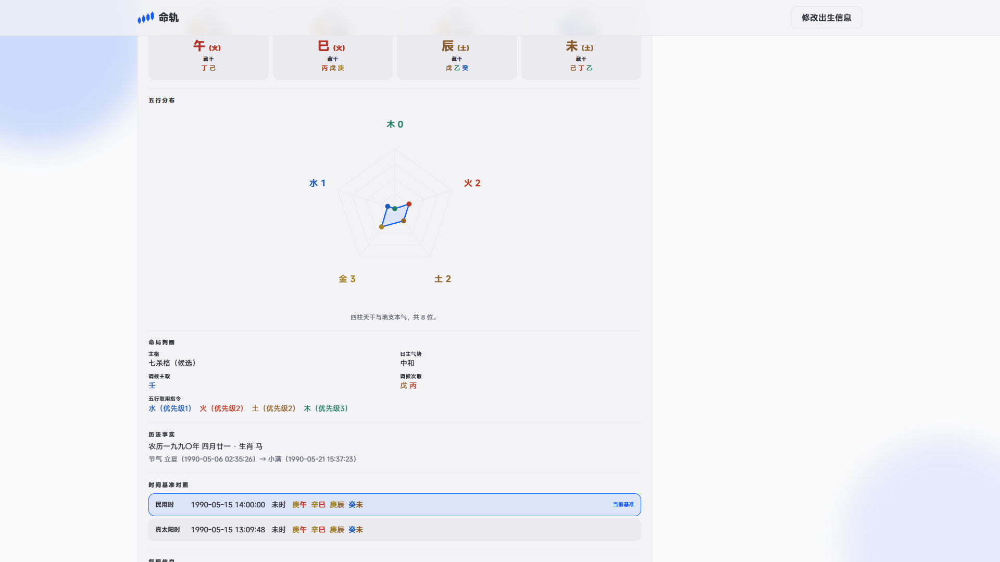

<p align="center">
  
</p>

<h1 align="center">命轨 · Bazi AI</h1>

<p align="center">可复现的传统八字趋势分析工具：确定性计算生成事实与证据，AI 只负责解释。</p>

> 这是文化娱乐用途的传统命理分析工具，不构成医疗、法律、投资、婚育或确定性预测建议。

## 它做什么

- 接收带秒和显式 UTC 偏移的出生瞬间、传统命理性别、IANA 时区、经度与一种时标（民用时或真太阳时）。
- 生成四柱、藏干、十神、十二长生、纳音、旬空、辅助柱、旺衰与格局裁决、大运、流年/月/日/时信息，以及带来源的规则证据。
- 在时辰、日、月、年四种粒度展示确定性趋势序列；日、月、年 K 线均由更低粒度的真实计算点聚合而成。
- 允许用户自带 OpenAI、Anthropic、Google 或 DeepSeek 的密钥获取结构化解读。模型不能生成或改写数值、K 线与规则事实。

## 产品展示

以下均为已部署站点的 $1920\times1080$ 实拍图，使用虚构的“演示样本”和“上海（模拟）”信息生成；密钥输入框始终为空。它们分别展示日 K 线与规则证据、月度聚合趋势，以及四柱与五行分布。







## 核心算法

记出生输入为 $X$，其中包含精确出生瞬间、传统命理性别、IANA 时区、经度与用户选择的时标；记 $R$ 为时间范围、 $d$ 为领域、 $q$ 为粒度。引擎的单一路径是：

$$
\begin{aligned}
X &\xrightarrow{\text{时刻规范化}} (t_{\mathrm{civil}}, t_{\mathrm{solar}}) \\
&\xrightarrow{\text{历法与节气}} \mathcal{C}
\xrightarrow{\text{命盘、大运与规则裁决}} \mathcal{E} \\
&\xrightarrow{\text{分层投影}} \mathcal{S}_{R,d,q}
\xrightarrow{\text{可选 BYOK}} \text{已校验的文字解读}
\end{aligned}
$$

其中 $\mathcal{C}$ 是历法、命盘与流转事实， $\mathcal{E}$ 是带来源的规则证据， $\mathcal{S}$ 是时辰点或由真实低粒度点聚合的 K 线。最后一步只读取 $\mathcal{C}$、 $\mathcal{E}$ 与 $\mathcal{S}$，不会回写它们。

### 1. 时刻、历法与真太阳时

- `birthInstant` 必须是带显式 UTC 偏移、精确到秒的 ISO-8601 时刻。若 $o_{\mathrm{declared}}$ 是输入声明的偏移， $o_{\mathrm{IANA}}(z,t)$ 是该时区在同一瞬间的历史偏移，则输入有效的必要条件是：

$$
o_{\mathrm{declared}} = o_{\mathrm{IANA}}(z,t)
$$

夏令时重叠会保留全部真实瞬间并要求用户明确选择；落入跳过区间的当地时间没有对应瞬间，因此被拒绝。

- 民用时 $t_{\mathrm{civil}}$ 由 $t$ 在 IANA 时区 $z$ 中格式化得到。真太阳时校正使用出生经度 $\lambda$、该瞬间的时区偏移 $o$（小时）与 NOAA 2006 均时差 $E(t)$：

$$
\begin{aligned}
\Delta_{\lambda} &= 4\bigl(\lambda - 15o\bigr) \\
\Delta_{\mathrm{solar}} &= \Delta_{\lambda} + E(t) \\
t_{\mathrm{solar}} &= t_{\mathrm{civil}} + \Delta_{\mathrm{solar}}
\end{aligned}
$$

所有校正量以分钟计。若 $t_{\mathrm{civil}}$ 与 $t_{\mathrm{solar}}$ 让日期或时辰发生变化，两个候选都会展示；同一快照只能选择其中一个时标。

- 历法事实由锁定的 `lunar-typescript@1.8.6` 生成。节气边界不是按出生地墙钟文本比较，而是在固定历法模型时标中换算为真实瞬间，再和 $t$ 比较：

$$
\mathrm{yearPillar},\ \mathrm{monthPillar}
= \mathrm{PillarsAtInstant}\bigl(t,\ \{\tau_j\}_{j=1}^{24}\bigr)
$$

这使立春、节气交界、闰月和跨时区场景具有相同的比较基准。

### 2. 命盘、裁决与可追溯证据

唯一的引擎组合入口是 [`calculateBaziSnapshot`](./src/domain/bazi/snapshot.ts)。在用户选定的时标 $s\in\{\mathrm{civil},\mathrm{trueSolar}\}$ 下，命盘和裁决的关系可概括为：

$$
\begin{aligned}
\mathcal{N} &= \mathrm{NatalChart}\bigl(t_s, t\bigr) \\
\mathcal{R} &= \mathrm{AdjudicateRelations}(\mathcal{N}) \\
\mathcal{Q} &= \mathrm{AssessQi}(\mathcal{N},\mathcal{R}) \\
\mathcal{J} &= \mathrm{ResolveFavorable}\left(
  \mathcal{N},\mathcal{Q},\mathrm{AssessStructure}(\mathcal{N},\mathcal{Q},\mathcal{R}),\mathcal{R}
\right) \\
\mathcal{L} &= \mathrm{LuckCycles}(t,z,g)
\end{aligned}
$$

$\mathcal{N}$ 包含四柱及其衍生事实， $\mathcal{R}$ 是关系裁决， $\mathcal{Q}$ 是旺衰证据， $\mathcal{J}$ 是格局与喜忌裁决， $\mathcal{L}$ 是大运。引擎再把这些事实和所选 $R,d,q$ 生成领域结论与时间序列。

规则目录位于 [`src/domain/bazi`](./src/domain/bazi)：每个结论携带稳定的规则标识、来源层、涉及对象、极性、数值方向、严重度与相关领域。显式合局会被标为 `formed`、`blocked`、`contested`、`untransformed` 或 `broken`；半合与拱合不会被伪装成已化的三合。

`algorithmVersion` 由冻结规则目录的指纹以及天文、历法模型修订共同构成。快照键截取 SHA-256 的前 16 个十六进制字符：

$$
k = \mathrm{prefix}_{16}\left(
\mathrm{SHA256}\left(
\mathrm{serialize}(X^{\ast},R,d,q,\mathrm{algorithmVersion})
\right)\right)
$$

$X^{\ast}$ 仅保留计算输入；姓名、地点名和纬度仅作展示元数据，因此不进入确定性计算或快照键。

### 3. 趋势指数与 K 线

趋势指数不是价格、概率或现实结果预测。设 $\ell$ 为一个活跃来源层， $h$ 为该层的一条规则命中， $v_h\in\{-1,0,1\}$ 为规则方向， $a_h$ 为严重度，则该层的支持与压力为：

$$
\begin{aligned}
P_{\ell} &= \sum_{h\in\ell,\ v_h=+1} a_h \\
N_{\ell} &= \sum_{h\in\ell,\ v_h=-1} a_h \\
b_{\ell} &= \frac{P_{\ell}-N_{\ell}}{P_{\ell}+N_{\ell}+4}
\end{aligned}
$$

分母中的常数 $4$ 是阻尼项。对于有方向性证据的活跃层集合 $A$，以固定权重 $w_{\ell}$ 汇总：

$$
\begin{aligned}
B &= \frac{\sum_{\ell\in A}w_{\ell}b_{\ell}}{\sum_{\ell\in A}w_{\ell}} \\
I &= \mathrm{clamp}_{[0,100]}\left(\mathrm{round}(50+30B)\right)
\end{aligned}
$$

固定层权重限制每个时间层的影响上限，阻止同层的大量重复关系机械地把指数推至端点。总览指数直接使用总规则证据；它不是其他领域分数的平均值。

时辰是包含准确瞬间与规则证据的原子点，不伪造 OHLC。对于一个聚合周期 $G$，其有序低粒度观测值为 $x_1,\dots,x_n$，则 K 线严格由这些真实值构成：

$$
\begin{aligned}
O_G &= x_1 & C_G &= x_n \\
H_G &= \max_{1\leq i\leq n}x_i & L_G &= \min_{1\leq i\leq n}x_i
\end{aligned}
$$

日 K 线的 $x_i$ 是该民用日的全部真实时辰点；月 K 线的 $x_i$ 是日 K 线，年 K 线的 $x_i$ 是月 K 线。因此每个聚合周期必然满足：

$$
L_G \leq O_G \leq H_G,
\qquad
L_G \leq C_G \leq H_G
$$

每根聚合 K 线保留收盘瞬间及对应的岁运流转信息。图中的两个派生指标同样由领域层计算，而非组件估算：

$$
\begin{aligned}
\mathrm{TrendCenter}_t &= \frac{1}{|W_t|}\sum_{i\in W_t}V_i,
&& W_t=\{\max(1,t-4),\dots,t\} \\
\mathrm{Intensity}_t &=
\begin{cases}
0, & t=1 \\
|V_t-V_{t-1}|, & t>1
\end{cases}
\end{aligned}
$$

其中 $V_t$ 是时辰点的值或 K 线收盘值。`TrendCenter` 只使用当期及之前最多五个周期，绝不读取未来数据。

## 古典文献：来源、实现与边界

项目把古籍作为可定位的规则来源，而不是把其中的吉凶、疾病、婚育、贫富或人物断语直接转成产品结论。运行时唯一的规则来源始终是冻结的 [`src/domain/bazi`](./src/domain/bazi) 目录。

| 文献 | 已冻结的实现范围 | 不作出的声称 |
| --- | --- | --- |
| 《子平真诠·论用神》 | 月令本气、普通格局锚点 | 不扩展为唯一用神或人生断语 |
| 《滴天髓·化气、从化》《衰旺》 | 化气与从格的严格门槛；季令、透干、藏干、根气与关系事实的气账本 | 工程权重不是古籍数值 |
| 《穷通宝鉴·十干分论》 | 十日干 × 十二月令的 120 条调候基础条款，以及明确的节气、节内阶段与五行偏旺覆写 | 不采纳不能表达为确定条件的流派引申或人物断语 |
| 《三命通会》 | 格局对读样例，以及多数神煞查表的文献定位 | 神煞不参与旺衰、格局、喜忌、领域结论或趋势指数 |
| 《五行精纪》《星学大成》《钦定古今图书集成》 | 天厨、华盖、红鸾天喜、将星等特定神煞查表的来源定位 | 不把单一出处泛化为全部神煞已获原典确认 |

完整的逐层对读、公开文本链接与未接入范围见 [主链文献证据与实现边界](./docs/classical-evidence.md)。神煞目录逐项标明“原典直引”“流派变体”或“待原典核验”；只有第一类可称为原典已核验，详见 [神煞文献证据库与目录](./docs/shensha-evidence.md)。项目不宣称传统命理的现实预测能力已被证明，也不宣称已完成具名命理师审校。

## AI 边界

- 仅使用固定的提供商预设，不接受任意服务地址。
- 用户密钥仅用于当次请求，不写入仓库、数据库、日志、分析事件或服务端环境变量。
- AI 返回内容必须通过结构化 schema 校验；无效输出会被拒绝。
- 模型不能改写确定性分数、K 线、命盘或规则证据，也不能输出诊断、保证事件或投资指令。

## 项目结构

| 路径 | 职责 |
| --- | --- |
| [`src/domain/bazi`](./src/domain/bazi) | 确定性输入、时刻/历法、命盘、大运、规则、关系、裁决、投影与 K 线聚合 |
| [`src/ai`](./src/ai) | 提供商预设、提示词、输出 schema 与模型调用 |
| [`src/app/api`](./src/app/api) | HTTP 输入校验与领域/AI 编排 |
| [`src/components`](./src/components) | 仅负责渲染，不重新计算命理事实或趋势分数 |
| [`tests`](./tests) | 历法边界、闰月、真太阳时、DST、大运、规则证据、K 线与 AI 合同回归测试 |
| [`docs`](./docs) | 文献证据、神煞目录与外部审校包 |

## 本地运行与验证

```bash
npm install
npm run dev
```

```bash
npm run typecheck
npm test
npm run build
```

应用是一个 TypeScript Next.js App Router 项目，可部署到 Vercel 的 Node.js 路由处理器；V1 不依赖独立后端、数据库、队列或定时任务。

## 关键验证范围

- 立春与节气边界、闰月、四柱对照与真太阳时跨日/跨时辰；
- IANA 夏令时重叠与跳过区间的瞬间身份；
- 大运顺逆与起运时刻；
- 原子时辰点与日/月/年 OHLC 聚合不变量；
- 相同输入与版本得到相同快照，显示元数据不改变计算结果；
- AI 输出 schema、引用约束，以及 AI 不能修改确定性结果的边界。

有关固定样本、历法模型差异和待人工审校项，参见 [ZP-1 验证与人工审校包](./docs/zp1-validation.md)。
